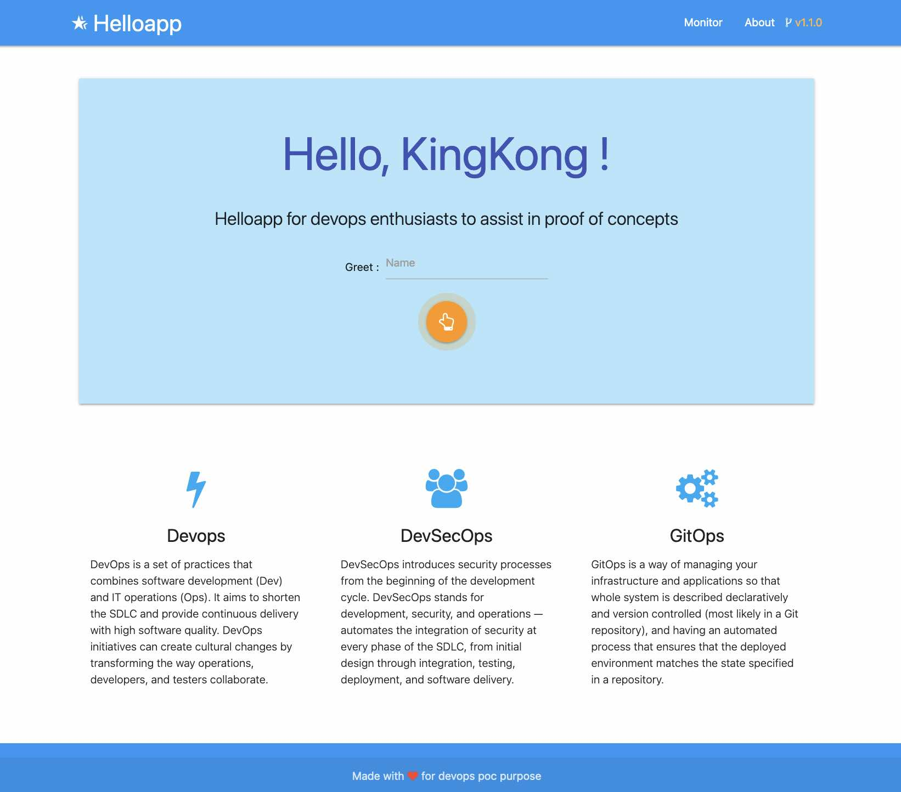

# helloappjava

Helloapp for devops enthusiasts to assist in proof of concepts

    

<hr>

### Introduction

A helloapp built with Java and Spring Boot for testing and POC purpose. This app expose a web interface and Api's to use for testing devops and cluster installation.



### Api's for the app

- Api to get app version ( note: It can be modified with app.version java property)

  `http://localhost:8080/api/version`

- Api to greet a user for the webapp

  `http://localhost:8080/api`

  `http://localhost:8080/api/greet`

  `http://localhost:8080/api/greet/<name>`

- Api for server info (_via Spring Boot Actuator_)

  `http://localhost:8080/manage`

- Api to get App info (incl. java, git )

  `http://localhost:8080/manage/info`

- Api for app health check

  `http://localhost:8080/manage/health`

- Api to get app properties and server environment variables

  `http://localhost:8080/manage/env`

### Functionalities

1. This java spring boot app is build tested with Java 11 and Java 17 ( need to change property in pom.xml to switch java version)
2. Get the app version (via api) and modify in source-code with java property app.version
3. Expose the greet api
4. Get server info, once deployed on Kubernetes (on homepage and via api in json format)
5. For running on Kubernetes, by using `kubectl kustomise` we can modify image (name & tag) and other configurable parans via updating kustomization.yaml in kubernetes folder.

   `$ kubectl kustomize ../kubernetes | kubectl -n helloappjava apply -f -`

6. This app can be built in 3 ways

   6.1 With Dockerfile added.
   
   6.2 With skafold ( configuration attached )
   
   6.3 With cloud-native buildpack
   

   - The buildpack command to build OCI image for app using `pack CLI` locally using container runtime.

     ```
     $ pack build helloappjava \
       --path ~/files/helloappjava \
       --buildpack paketo-buildpacks/java  \
       --builder paketobuildpacks/builder:full \
       --env BP_JVM_VERSION=17
     ```

   - The buildpack command to build OCI image for app using `kpack [kp] CLI` in kubernetes cluster configured with remote image registry.

     ```
     $ kp image create helloappjava \
        --tag registry.mylab.com/rsingh-lib/helloappjava \
        --cluster-builder default \
        --namespace helloappjava \
        --wait \
        --git https://github.com/rajks24/helloappjava.git \
        --git-revision impl-2.0 \
        --env BP_JVM_VERSION=17
     ```

     **NOTE:** we can change java version for buildpack with the `--env BP_JVM_VERSION=17`

### TODOS

1. Add open api swagger

## Contact

You can reach me on [Twitter @rajinh24](https://twitter.com/rajinh24)

## License

[](./LICENSE)

<hr>
